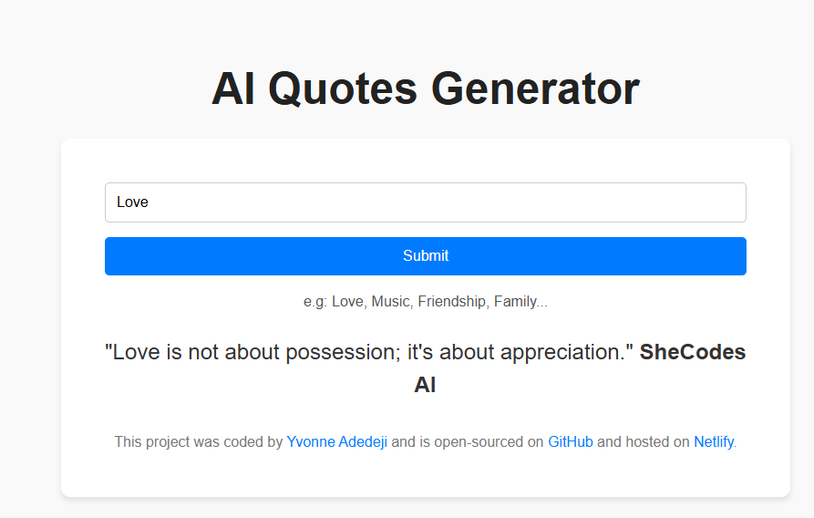
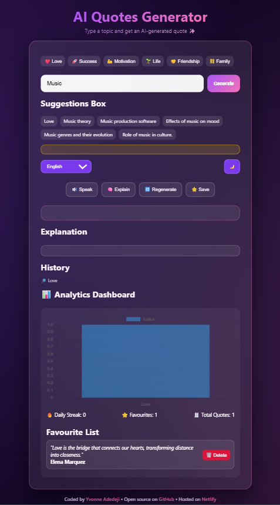
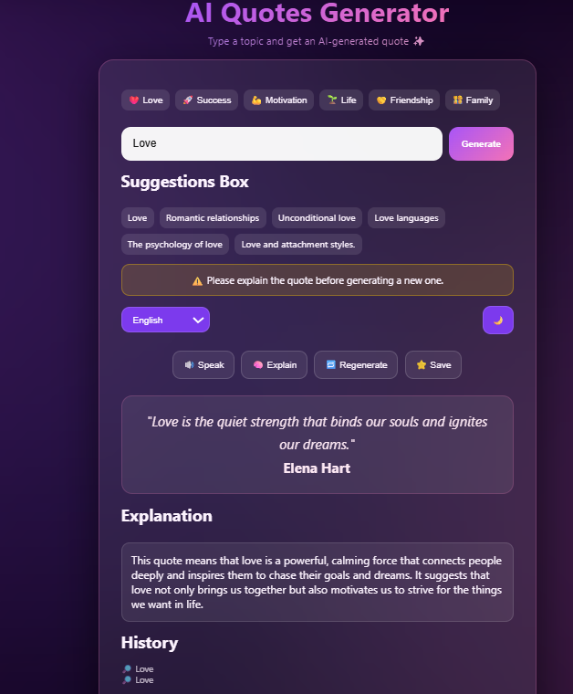
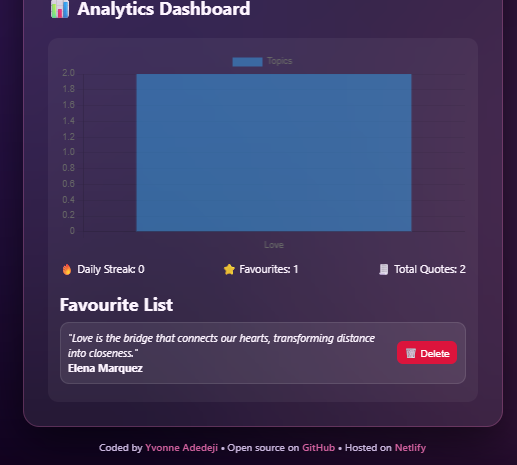

# ai-generator

## 📌 Description
The AI Quotes Generator is a simple web application that uses AI to generate quotes based on user-entered keywords. With a clean and intuitive interface, users can input any word and receive an AI-generated quote related to that keyword.

The app now includes enhanced interactivity such as suggestions, explanations, favourites, and analytics, creating a more engaging and personalised user experience.

## 🛠 Prerequisites
* 🌐 A modern web browser such as Chrome, Firefox, Safari, or Edge
* 📶 An active internet connection (required for API requests)

## 📋 Features
🔍 Core Functionality
* Allow users to input any keyword/topic
* Fetch AI-generated quotes based on the keyword
* Support multiple languages (English, French, Spanish, etc.)

✨ User Experience
* Display quotes with a typewriter animation effect
* Clean, modern, and fully responsive interface
* Quick topic buttons for fast input (e.g - Love, Success, Life)
* Dark/Light mode toggle for better accessibility

 ## 💻 Technologies Used
The application is built with the following technologies:
* HTML
* CSS
* JavaScript
* TypewriterJS
* Axios 
* Chart.js

## 🚀 Installation
No installation is required to use the app. It is hosted online and can be accessed via a web browser.

## 📚 Usage
1. Open the web application in your browser.
2. Enter a keyword in the input field or select a quick topic.
3. Click the Generate button to create a related quote.
4. The quote will be displayed on the page with a typewriter effect.
5. Use additional features:
* Listen to the quote
* Generate an explanation
* Save to favourites
* Regenerate a new quote
6. Explore the analytics dashboard and history section.

## 🔗 Live Demo & Repository
Application can be viewed here: 
* 🌐 Live: https://ya-ai-generator.netlify.app/
* 💻 Repository: https://github.com/yvonnesarah/ai-generator

## 🖼 Screenshot
Before Design

AI Generator Interface

After Design

AI Generator Interface

AI Generator - Love Example

AI Generator - Love Dashboard

## 🗺️ Roadmap (Planned Features)
To expand the capabilities of the AI Generator and deliver smarter, more contextual outputs, the following features are planned:

🤖 AI Enhancements
* Fetch related topic suggestions dynamically ✅
* Provide simple AI-generated explanations of quotes ✅
* Regenerate new quotes based on the same topic ✅

⚡ Interactivity & Controls
* Text-to-speech (read quotes aloud) ✅
* Action buttons: Speak, Explain, Regenerate, Save ✅
* Smart alert system to guide user flow ✅

## 🚀 Upcoming Features
These upcoming improvements focus on making the AI Generator more intuitive, visually engaging, and user-friendly:

💾 Data Persistence
* Save favorite quotes (with delete option) ✅
* Store recent search history (last 5 topics) ✅
* Persist data using browser local storage ✅

📊 Analytics Dashboard
* Track total number of generated quotes ✅
* Display favorite count ✅
* Show topic usage trends with a bar chart ✅
* Highlight trending topics (most searched) ✅

## 🧠 Advanced Features (Professional Level)
These advanced capabilities are designed to optimize performance, enhance reliability, and provide a more refined AI experience:

💡 Smart Features
* Debounced input to optimize API calls ✅
* Combined suggestions (AI + trending topics) ✅
* Loading and error handling states ✅

## 🧠 Challenges & Learnings
🚧 Challenges Faced

1. API Integration & Reliability
Handling inconsistent or delayed responses from the AI API.
Implementing fallback states for errors and failed requests.

2. State Management & Async Behaviour
Managing loading, success, and error states smoothly.
Ensuring UI updates correctly after asynchronous API calls.

3. UI/UX Enhancements
Synchronising the typewriter animation with incoming API data.
Maintaining a clean and responsive layout across devices.

4. Data Persistence
Implementing local storage for favourites and search history.
Ensuring data remains consistent across sessions.

5. Analytics & Visualisation
Structuring data for Chart.js to display meaningful insights.
Tracking user interactions such as popular topics and quote generation counts.

📚 Key Learnings

1. Improved understanding of working with third-party APIs.
2. Better handling of asynchronous JavaScript patterns (Promises & async/await).
3. Strengthened skills in creating interactive and user-focused UI components.
4. Learned how to design lightweight analytics features for frontend applications.

## 👥 Credit
Designed and developed by Yvonne Adedeji.

This project makes use of the following tools and libraries:

* TypewriterJS – Used to create the typewriter animation effect for displaying quotes

* Axios – Used for making HTTP requests to fetch AI-generated quotes

* Chart.js – Used to display analytics and topic trends

## 📜 License
This project is open-source. For licensing details, please refer to the LICENSE file in the repository.

## 📬 Contact
You can reach me at 📧 yvonneadedeji.sarah@gmail.com.
